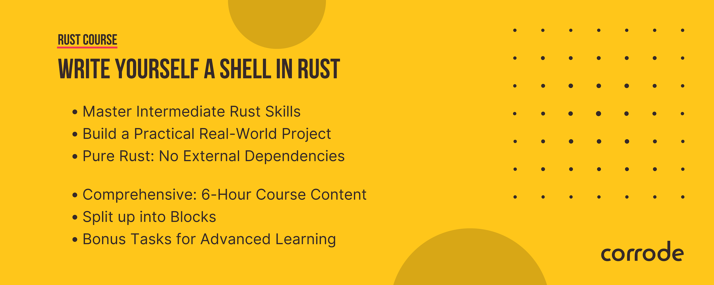

# Write Yourself A Shell in Rust



## Introduction

One of the things developers use every day is a [shell](https://multicians.org/shell.html). It comes in many flavors like `bash`, `fish` or `zsh`. Depending on your background, writing your own shell from scratch might either sound intimidating or pointless. We like to believe that it can be a fun way to gain more hands-on Rust experience. If you want to play with concepts like I/O, error handling, and syscalls we invite you to participate in this workshop. Who knows, it could also be an opportunity to start your first mid-size Rust project?

> [!NOTE]
> Shells are very complex and we will only implement a basic subset of their functionality.
> Take this workshop as an excuse to learn Rust rather than a guide for how to write the perfect shell.

## Who's the Target Audience?

This workshop is intended for *intermediate* Rust programmers who already understand basic Rust concepts and have some programming experience. We’ll explain the rest as we go along.
When we were learning Rust, we always wanted to see a mid-size system being built to get an understanding of how the concepts are put into practice. We think this could be a learning boost for people who are in the same situation as we were.

### Necessary Tools

* [rust](https://www.rust-lang.org/tools/install)
* [git](https://git-scm.com/)

## Structure

Every commit adds one new feature or refactors the code in a significant way.
You can `git checkout <commit_id>` to see what the code looks like after each step.

You can always check your implementation by running `./validate`.

(Validate script was adapted from the majestic [build-your-own-shell](https://github.com/tokenrove/build-your-own-shell) by Julian Squires.)

## Features We Cover

1. Running single commands
2. Concatenating commands with semicolon
3. Shell-builtins (`cd`)
4. Pipes
5. Ideas for extending your shell
   - readline
   - handling control signals (<kbd>Ctrl</kbd> + <kbd>c</kbd>, <kbd>Ctrl</kbd> + <kbd>d</kbd>)
   - redirection
   - command completion
   - adding more builtins
   - use a grammar for parsing
   - Hints for the workshop

## Block 0 - Check Rust Installation and Version

Run `rustc --version`.
You should see something like `rustc 1.74.0 (79e9716c9 2023-11-13)`.

## Block 1 - Running Single Commands

- Try to run a single command and print the output to the stdout.
- Hint: Use [Command](https://doc.rust-lang.org/std/process/struct.Command.html) from the standard library.
- Bonus: Try to make the code as idiomatic as you can.
- Bonus: Write a unit test to make sure your shell works.

## Block 2 - Concatenating Commands

- Try to run two commands in sequence and print all output in sequence
  to `stdout`.
- Bonus: Write an [integration test](https://doc.rust-lang.org/rust-by-example/testing/integration_testing.html).

## Block 3 - Builtins

Builtins are commands, that are implemented inside the shell itself (so, literally "built in").
They serve common needs that most users will have, like printing things with `echo`.

- What would be a nice way to handle builtins?
- Implement a builtin of your choice (e.g. `exit`, `echo`, `cd`, 
  `for`,...).
- Bonus: Think about why `cd` must be a builtin.

## Block 4 - Shell History

- Add support for the `history` command, which lists all previously executed commands.
- Bonus: Think of other ways to store the history (e.g. in a database).

## Block 5 - Pipes

- Implement pipes, which are a way to feed the output of one command into another one.
	Syntax:

	```shell
	command1 | command2
	```

- Bonus: Think about ways to make command representation more idiomatic.

## Block 6 - Bring your own features (e.g. "where the fun is at")!

* Add readline support
* Handle control signals (ctrl+c, ctrl+d)
* Redirection
* Command completion
* Implement more shell-builtins
* Use a grammar for parsing
* Add more tests

## Show And Tell!

We are curious to see what you have built. If you want to share your shell with
us, please send us a link to your repository. We will add it to the list below.

We'd be happy to hear your answers to the following questions:

- What did you learn?
- What was easy?
- What was hard?
- Would you do anything differently?
- What would you like to learn next?

## Closing Words

If you enjoyed this workshop, please share it with your friends and colleagues.
It would greatly help us if you could tweet/toot about it or share it on
[Reddit](https://www.reddit.com/r/rust/) or [LinkedIn](https://www.linkedin.com/).
Thanks!

You might also want to [subscribe to our newsletter](https://corrode.dev/blog/) for
future workshops and other Rust content.

If you are looking for professional Rust training, please get in touch with us
at [corrode.dev](https://corrode.dev/).
